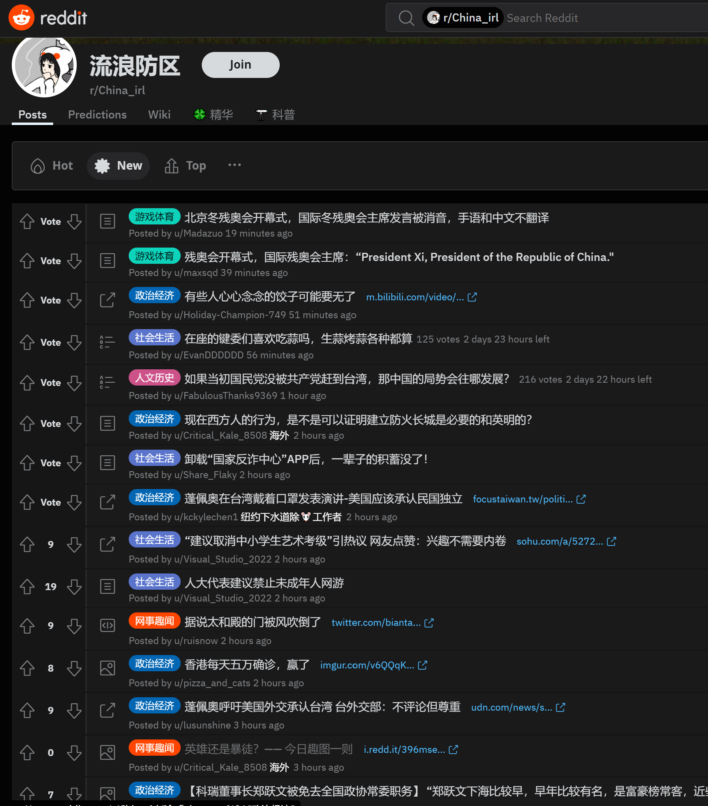
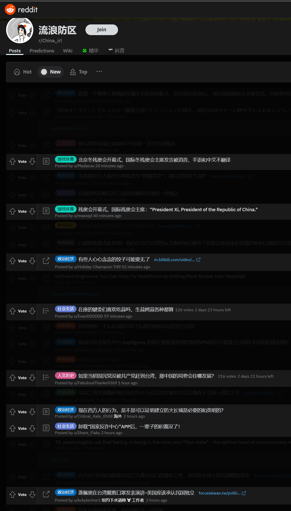
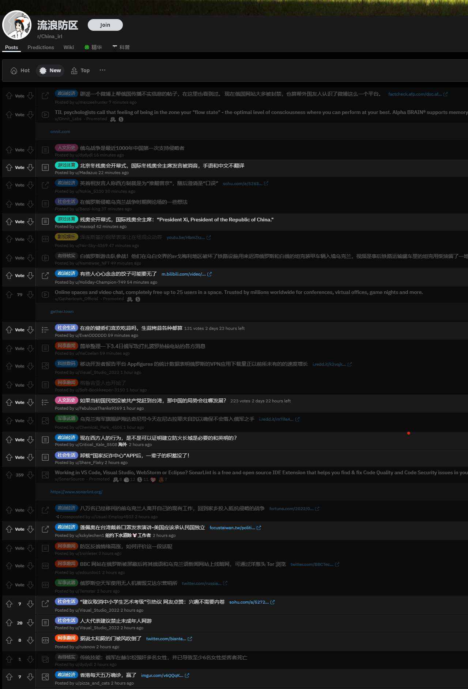

# CheckKeywords

reddit 通过关键词显示或隐藏帖子

## 效果图示





## 使用 usage

1. 安装 chrome 插件 tampermonkey
2. 去 github 下载代码
3. 使用 tampermonkey 创建新脚本, 你会发现 tampermonkey 自动打开了一个编辑器
4. 在本项目中找到 final/main.js 文件中的代码
5. 使用{4 中提到的代码}全部替换{3 中提到的编辑器中已经存在的代码}, 保存

### 配置 config

```js
//  🚧🔧🔩🧱 关键词
const BlockKeyWords = [
  '俄',
  '乌',
  '哈尔科夫',
  '格鲁吉亚',
  '普京',
  '泽连斯基',
  '北约',
]
//  🚧🔧🔩🧱 是否隐藏列表中的广告
const HideAD = true
//  🚧🔧🔩🧱 是否隐藏标题中存在关键词的 POST
const HideFlag = true
//  🚧🔧🔩🧱 隐藏方式, Dim = true 则使用 opacity:0.1 而非 display:none, 你可以使用这种方式检测那些帖子被屏蔽了
const Dim = false
```

## 开发 development

做过前端的人应该都懂, 我主要是使用 `yarn start;` 和 tampermonkey 的 @require 关键字, 让 tampermonkey 每次都读取本地的代码, 使用方式见 entry/init.Windows.js
